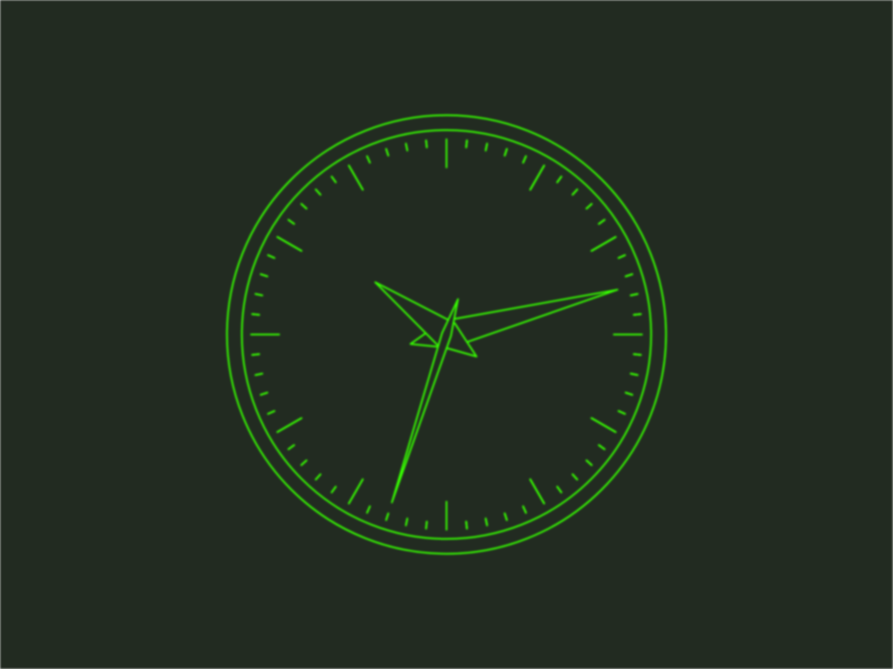

# Clock Demo

As demonstration of my abilities with TypeScript and React, this project renders an analog clock in the style of an old vector display.

It looks like this:

This project was bootstrapped with [Create React App](https://github.com/facebook/create-react-app).

## Setup

Install npm packages:

    npm install

## Development

Start the development server:

    npm start

## Testing

Run tests with jest:

    npm test

## Contributing

Run eslint before contributing:

    npm run lint

Alternatively, fix some lint errors in place:

    npm run lint:fix

## TODO

Some ideas

- [ ] Extract all time related magic numbers into some sort of model layer
- [ ] Play with CSS/SVG WebGL shaders to further simulate a CRT display
- [ ] Make some typed helpers for rendering SVG path command strings
- [ ] Time travel
